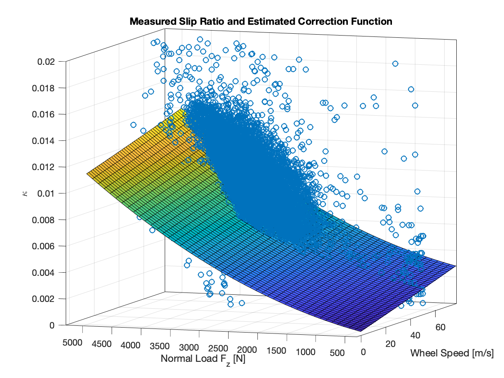

# VehicleAnalysis

VehicleAnalysis is a collection of MATLAB libraries related to analyzing vehicle performance.

## Usage
Run the `init_vehicle_analysis_paths.m` script to add the directories for each library to your current path.

This was developed on MATLAB R2018a, older or new versions have not been tested.

## Libraries

### Motec
Classes for parsing MoTeC log data that has been exported from MoTeC i2 as a `.mat` file and extracting channels from the log data.

The base class provides a consistent interface for querying common channels like speed or steer angle, while the derived classes are responsible for defining how to parse each channel (e.g. define the channel name, perform unit conversions, etc.).

Example:
```
# Load the log
handler = MotecHandler();
handler = handler.loadFromFile('/path/to/my/file.mat');

# Trim out some data
handler = handler.trimTimeRange(123.0, 456.0);

# Query some channel
[a, t] = this.getChannel('G_LAT');

# Query some channel only within some time range
[a_sub, t_sub] = this.getChannel('G_LAT', 200.0, 250.0);

# If you created your own motec handler for a particular use case you coudl query quantities directly
something_handler = MotecHandlerSomething();
[ax, t] = something_handler.getLongitudinalAccel();

```

#### Specializations
**MotecHandlerAcc**: For operating on log data produced from Assetto Corsa Competizione.

### Setup
The `Setup` class captures an assortment of vehicle attributes related to defining its geometry and dynamics. It is primarily a container for holding quantities, but also contains various functions for converting or estimating some quanitites (e.g. converting between spring and wheel rates).

Information the `Setup` class contains (not an exhausive list):
* Wheelbase and track width
* Sprung and unspring mass and CoG locations
* Wheel geomtry (camber, toe)
* Suspension properties (spring rates, ARB rates, ride height)
* Aerodynamic settings and force functions for downforce and drag

#### Specializations
**SetupAcc**: Version that can populate a `Setup` object from a setup file for Assetto Corsa Competizione.

### Tire
Contains an implementation of the Pacejka tire model from:  
> *Tire and Vehicle Dynamics - 3rd Edition, Hans Pacejka* and tooling for interacting with the tire model.

This has functionality for Fx0, Fx, Fy0, and Fy. It doesn not contain the expressions for aligning torque, or the extension for turn slip.

#### PacejkaTireModel
Contains the model implementation, which can be queried for forces or estimate tire parameters from empircal data.

Example of querying Fx0:
```
model = PacejkaTireModel();

Fz = 3000;
P = 30.0;
kappa = linspace(0, 0.5);
gamma = 0.0;
V0 = 30.0;
Vs = kappa * V0;
[Fx0, ~] = model.Fx0(Fz, P, kappa, gamma, Vs, V0);
```

Model parameters can also be estimated from emprical data, and inequality constraints can be applied to individual parameters during the estimation process.

Example of estimating Fx0 parameters:
```
model = PacejkaTireModel();

% Create the input data
Fz = 3000;
P = 30.0;
kappa = linspace(0, 0.5);
gamma = 0.0;
V0 = 30.0;
Vs = kappa * V0;

% Get the Fx0 force values for the sample parameter set
[Fx0_ref, ~] = model.Fx0(Fz, P, kappa, gamma, Vs, V0);

% Perturb the model parameters
model.PFx0 = 1.2 * model.PFx0;
[Fx0_perturbed, ~] = model.Fx0(Fz, P, kappa, gamma, Vs, V0);

% Add noise to some sample data generated with the original model
Fx0_meas = normrnd(Fx0_ref, 100);

% Fit a new model
model = model.fitFx0(Fx0_meas, Fz, P, kappa, gamma, Vs, V0, 1, true);
[Fx0_fitted, ~] = model.Fx0(Fz, P, kappa, gamma, Vs, V0);

figure;
hold on;
grid on;
xlabel('\kappa');
ylabel('F_x_0 [N]');
plot(kappa, Fx0_ref, 'b-', 'DisplayName', 'Ref');
plot(kappa, Fx0_perturbed, 'r-', 'DisplayName', 'Perturbed');
plot(kappa, Fx0_meas, 'rx', 'DisplayName', 'Measured');
plot(kappa, Fx0_fitted, 'g--', 'DisplayName', 'Fitted');
legend(gca, 'show');
```


#### pacejka_gui
GUI that allows you to manipulate model parameters and visualize the Fx(k) and Fy(alpha) curves.


#### TireAnalysis
Utility class for generating plots from a tire model and feeding log data (from a MotecHandler) into the model to estimate the parameters.

* Generate Fx(k) and Fy(alpha) plots for various configurations
* Genrate Fx vs. Fy plots for various configurations
* Estimate a longitudinal slip correction factor to account for tire compression/elongation as a function
* Comparing measured and predicted tire forces
* Plotting coverage of data used for parameter estimation

Example for generating force plots:
```
model = PacejkaTireModel();
analysis = TireAnalysis();

% Fx vs Fy curves
model = analysis.resetModelToSampleParameters(model);

alpha_vals = [-15, -8, -3, 0, 3, 8, 15];
Fz_range = 1e3 * [1, 3, 5];
P_range = [26.5, 27.5, 28.5];
gamma_range = [2, 3, 4];
kappa_range = [0, 0, 0.3];

analysis.plotFxVsFy(model, alpha_vals, Fz_range, P_range, gamma_range, kappa_range);

% Fx and Fy curves
model = analysis.resetModelToApproximateGT(model);

mu_max = 2.5;
n_curves = 5;
Fz_range = 1e3 * [1, 4, 5];
P_range = [26.5, 27.5, 28.5];
alpha_range = [0, 0, 20];
kappa_range = [0, 0, 0.20];
gamma_range = [0, 3.0, 4.0];

analysis.plotForceCurves(model, mu_max, n_curves, Fz_range, P_range, alpha_range, kappa_range, gamma_range);
```

Tire model plots:


Longitudinal slip correction estimation:


Plots for data coverage used for parameter estimation:


